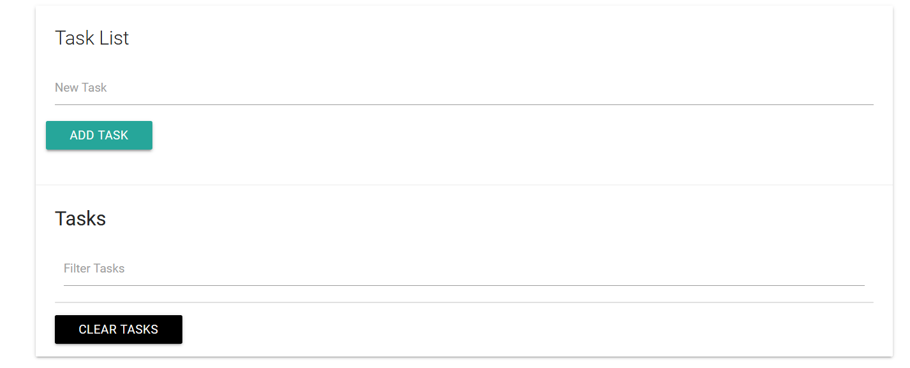

# Task List 
This is a Task List App created using Html, Css, Javascript, and Materialize

## Developed By
> Nishkarsh Dubb

## Screenshots


## Developed using
* Html
* css
* javascript
* materialize

## Setup:

#### Clone this repository:

```bash
git clone https://github.com/Nishkarsh01/task-list.git
```
or download the zip file from github.

After extracting the files, 

* 1  .``cd task-list`` 
* 2  .``open index.html``

## Collaborate
To collaborate, reach me on [nishdubb11@gmail.com]()

## Further help

To get more help on the Javascript go check out the [MDN Javascript Documentation](https://developer.mozilla.org/en-US/docs/Web/JavaScript).

